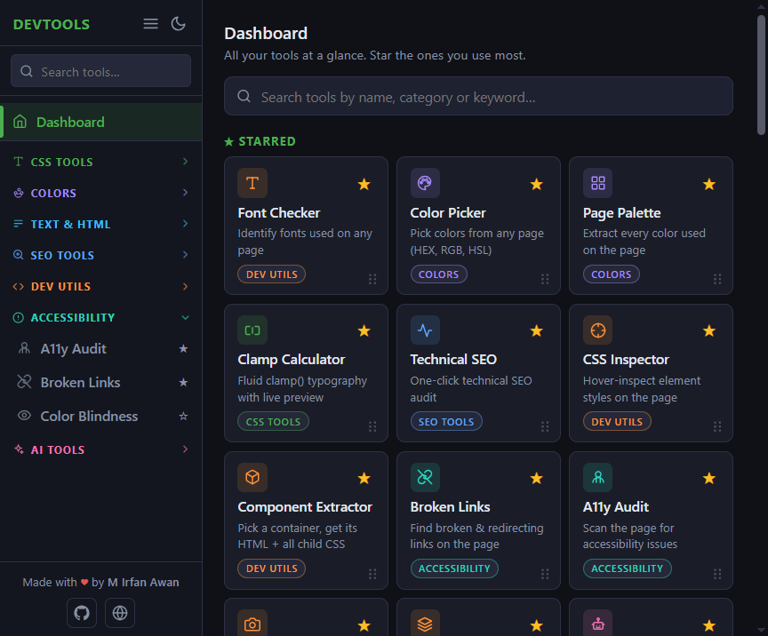
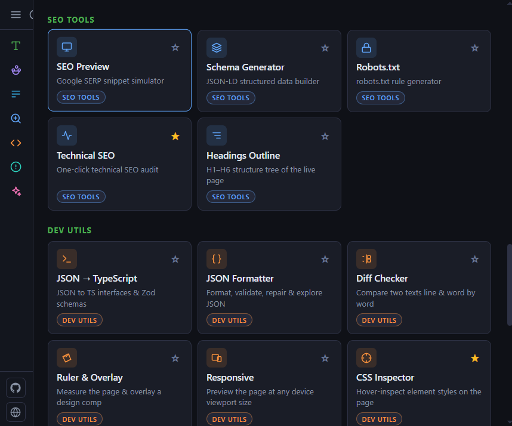

<div align="center">


# Web Dev Tools

### 37 web-development, SEO, design, accessibility &amp; AI tools in one Chrome extension. 100% on-device, no accounts, no APIs.

[](https://developer.chrome.com/docs/extensions/mv3/intro/)
[](#)
[](#-the-toolbox)
[](#-built-with)
[](#-privacy--permissions)
[](LICENSE)

Format CSS, audit SEO, pick colors, inspect styles, screenshot whole pages, detect a site's tech stack, prep your content for AI search, and **30+ more**, all from one tidy popup that never sends your data anywhere.

</div>

---

## Table of Contents

- [Why Web Dev Tools?](#-why-web-dev-tools)
- [Screenshots](#-screenshots)
- [Installation](#-installation)
- [Quick Start](#-quick-start)
- [The Toolbox](#-the-toolbox)
- [Who Is It For?](#-who-is-it-for)
- [Privacy &amp; Permissions](#-privacy--permissions)
- [Built With](#-built-with)
- [Project Structure](#-project-structure)
- [Contributing](#-contributing)
- [Roadmap](#-roadmap)
- [FAQ](#-faq)
- [License](#-license)
- [Author](#-author)

---

## ⭐ Why Web Dev Tools?

Most developers juggle a dozen browser extensions and as many websites: one to format JSON, one to pick a color, another to check contrast, yet another that quietly uploads everything you paste to some server. **Web Dev Tools replaces that pile with a single, fast, private popup.**

- **🧰 37 tools, one extension.** CSS generators, color utilities, SEO audits, accessibility checks, dev utilities, page inspectors, and modern AI/GEO tools.
- **🔒 Truly private.** Everything runs locally in your browser. No accounts, no analytics, no third-party servers, no API keys. Your code and the pages you inspect never leave your machine.
- **🚫 No external APIs.** Audits, formatters, parsers, and detectors are all implemented on-device, so they work offline and on internal/staging sites too.
- **⚡ Zero dependencies, instant load.** Plain HTML, CSS, and JavaScript. No framework, no build step, no bloat. Tools lazy-load the moment you open them.
- **🎨 Consistent, modern UI.** A unified design system with light/dark themes, a searchable sidebar, a dashboard, and starrable favorites.
- **🤖 Ready for the AI era.** Tools for `llms.txt`, GEO/AEO readiness, and one-click "copy page as Markdown for ChatGPT/Claude."

---

## 📸 Screenshots

> _Drop your images into the [`screenshots/`](screenshots/) folder using the exact filenames below, then uncomment the block underneath to display them._

| Dashboard | A tool in action |
| :---: | :---: |
| _`screenshots/dashboard.png`_ | _`screenshots/tool.png`_ |

<!-- Uncomment once the images are added:
<p align="center">
  
  
</p>
-->

---

## 🚀 Installation

### Option A: Load from source (developer mode)

1. **Download** this repository (Code → Download ZIP) or clone it:
   ```bash
   git clone https://github.com/irfanawanwebdev/web-dev-tools.git
   ```
2. Open Chrome and go to **`chrome://extensions`**.
3. Toggle **Developer mode** on (top-right).
4. Click **Load unpacked** and select the project folder (the one containing `manifest.json`).
5. Pin the **Web Dev Tools** icon to your toolbar and you're ready.

> Works in any Chromium-based browser: **Chrome, Edge, Brave, Opera, Arc, Vivaldi.**

### Option B: Chrome Web Store

> _Coming soon._ A published listing link will go here.

---

## 🏁 Quick Start

1. Click the **Web Dev Tools** icon on any web page.
2. Use the **Dashboard** to browse all tools, or the **sidebar** to jump straight to a category.
3. **Search** for a tool by name or keyword (e.g. type `json`, `contrast`, `screenshot`).
4. **★ Star** the tools you use most, and they pin to the top of your dashboard.
5. Page-aware tools (Color Picker, CSS Inspector, audits, screenshots…) act on **the tab you're currently viewing**.

That's it. No sign-up, no setup.

---

## 🧰 The Toolbox

<details open>
<summary><b>🎨 CSS Tools (7)</b></summary>

| Tool | What it does |
| --- | --- |
| **Clamp Calculator** | Fluid `clamp()` typography with a live viewport preview |
| **Box Shadow** | Multi-layer shadow generator with presets |
| **Gradient** | Linear, radial &amp; conic gradient builder |
| **Fluid Design System** | Fluid type scales exported as CSS design tokens |
| **Animation Builder** | Keyframes &amp; cubic-bezier easing editor |
| **Glassmorphism** | Glass &amp; neumorphism effect generator with contrast checks |
| **CSS Snippets** | Container queries, logical properties, `:has()` and more |

</details>

<details>
<summary><b>🌈 Colors (4)</b></summary>

| Tool | What it does |
| --- | --- |
| **Color Picker** | Eyedrop any pixel on the page; HEX, RGB, HSL, OKLCH |
| **Color Contrast** | WCAG AA/AAA checker that suggests multiple accessible fixes |
| **Page Palette** | Extracts every color used on the current page with counts |
| **Color Scale** | Tailwind-style 50–950 shade scales (incl. OKLCH output) |

</details>

<details>
<summary><b>📝 Text &amp; HTML (5)</b></summary>

| Tool | What it does |
| --- | --- |
| **Lorem Ipsum** | Placeholder text generator |
| **Text Case** | Convert between upper, lower, title, camel, snake, etc. |
| **Unit Converter** | px ↔ rem, em, vh, vw, % and back |
| **HTML Beautify** | Beautify or minify HTML markup |
| **Encoder / Decoder** | Base64, URL, and HTML entities, both directions, live |

</details>

<details>
<summary><b>🔍 SEO Tools (5)</b></summary>

| Tool | What it does |
| --- | --- |
| **SEO Preview** | Google SERP snippet simulator with pixel-width warnings |
| **Schema Generator** | JSON-LD structured-data builder |
| **Robots.txt** | Modern `robots.txt` generator with AI-crawler presets |
| **Technical SEO** | One-click ~28-point technical SEO audit with a score |
| **Headings Outline** | H1–H6 structure tree of the live page |

</details>

<details>
<summary><b>🛠️ Dev Utilities (10)</b></summary>

| Tool | What it does |
| --- | --- |
| **JSON Formatter** | Format, validate, **auto-repair**, minify &amp; explore JSON in a tree |
| **JSON → TypeScript** | Generate TS interfaces &amp; Zod schemas from JSON |
| **Diff Checker** | Compare two texts line- and word-by-word, side-by-side or unified |
| **CSS Inspector** | Hover-inspect computed element styles on any page |
| **Component Extractor** | Pick a container, get its HTML + the CSS of every child |
| **Tech Stack** | Detect CMS, frameworks, themes &amp; plugins (Wappalyzer-style) |
| **Font Checker** | Identify fonts on any page with a live floating panel |
| **Screenshot** | Full-page (scroll &amp; stitch) or visible-area capture |
| **Ruler &amp; Overlay** | Measure the page and overlay a design comp pixel-perfect |
| **Responsive** | Preview any page at any device viewport + device screenshots |

</details>

<details>
<summary><b>♿ Accessibility (3)</b></summary>

| Tool | What it does |
| --- | --- |
| **A11y Audit** | Scan the page for WCAG issues (alt text, ARIA, contrast, focus…) |
| **Broken Links** | Find broken &amp; redirecting links with export to CSV/JSON/MD |
| **Color Blindness** | Simulate 8 types of color vision deficiency live on the page |

</details>

<details>
<summary><b>🤖 AI Tools (3)</b></summary>

| Tool | What it does |
| --- | --- |
| **Copy as Markdown** | Turn any page into clean, LLM-ready Markdown for ChatGPT/Claude |
| **AI Readiness** | GEO/AEO audit: AI-crawler access, `llms.txt`, machine readability |
| **llms.txt** | Generate &amp; view a site's `llms.txt` content map for AI assistants |

</details>

---

## 👤 Who Is It For?

| You are a… | …and you'll love |
| --- | --- |
| **Front-end developer** | CSS generators, JSON formatter, diff checker, unit converter, component extractor |
| **Web designer** | Color picker, palette extractor, color scales, glassmorphism, the pixel ruler &amp; design overlay |
| **SEO specialist** | Technical SEO audit, SERP preview, schema &amp; robots.txt builders, headings outline |
| **Accessibility tester** | A11y audit, WCAG contrast checker, color-blindness simulator, broken-link finder |
| **QA / tester** | Responsive viewport tester, full-page screenshots, broken links |
| **Content / AI strategist** | Copy-as-Markdown, AI readiness audit, llms.txt generator |
| **Agency / freelancer** | One private toolkit for client audits, works on staging and intranet sites too |

---

## 🔒 Privacy &amp; Permissions

**Web Dev Tools is built privacy-first.** There are no accounts, no analytics, no telemetry, and no third-party servers. Everything is computed on your device. The only network requests it ever makes are to **the site you are actively inspecting**, for example fetching that site's own `robots.txt`, `sitemap.xml`, or checking its links, and those results never leave your browser.

The extension requests the minimum permissions needed for its tools to work:

| Permission | Why it's needed |
| --- | --- |
| `activeTab` | Act on the tab you're currently viewing when you open a tool |
| `scripting` | Run the analysis/inspection scripts (color picker, audits, font checker, etc.) on the current page |
| `storage` | Save your settings, theme, starred tools, and pinned items **locally** |
| `clipboardWrite` | Copy results (code, colors, reports, screenshots) to your clipboard |
| `host_permissions` (`<all_urls>`) | Let the tools read/analyze whatever page you choose to run them on |
| `declarativeNetRequest` | Used **only** by the Responsive tester to preview sites in a frame (it strips frame-blocking headers for that one preview tab) |
| `webNavigation` | Used **only** by the Responsive tester to locate the preview iframe for full-page device screenshots |
| `favicon` | Show site icons (SERP preview) from **Chrome's local favicon cache**, so no network request is ever made for them |

---

## 🧱 Built With

- **Vanilla JavaScript, HTML &amp; CSS**: no framework, no bundler, no `node_modules`.
- **Chrome Manifest V3**: service worker, `chrome.scripting`, scoped `declarativeNetRequest` session rules.
- **A shared design system**: CSS custom properties (design tokens), reusable components, and light/dark themes.
- **Lazy initialization**: each tool boots only when first opened, keeping the popup snappy.
- **Zero runtime dependencies**: nothing to install, audit, or keep up to date.

---

## 🗂️ Project Structure

```
web-dev-tools/
├── manifest.json        # MV3 manifest (permissions, action, background)
├── popup.html           # Sidebar, dashboard, and all 37 tool panels
├── popup.css            # Design tokens, themes, and all tool styles
├── popup.js             # Tool logic, registry, lazy-init, and injected scripts
├── background.js        # Service worker (link checks, captures, DNR rules)
├── responsive.html      # Responsive Viewport Tester preview page
├── responsive.js        # Preview logic (device frames, UA, screenshots)
├── pack.ps1             # Builds a clean Web Store zip (runtime files only)
└── icons/               # Extension icons (16 / 48 / 128 px)
```

> **Packaging note:** when uploading to the Chrome Web Store, don't zip the repo folder directly (it would include `.git/` and local tool configs). Run `powershell -ExecutionPolicy Bypass -File .\pack.ps1` instead — it produces `dist/web-dev-tools-v<version>.zip` containing only the files the extension needs.

---

## 🤝 Contributing

Contributions, bug reports, and tool ideas are welcome!

1. **Fork** the repo and create a branch: `git checkout -b feature/my-tool`.
2. Make your changes (no build step, just edit and reload the unpacked extension).
3. Keep the style consistent: reuse the existing design tokens and shared components, and register new tools in the `TOOLS` array in `popup.js`.
4. **Test** by loading the unpacked extension and exercising the tool on real pages.
5. Open a **Pull Request** describing what you changed and why.

Found a bug or have an idea? [Open an issue](https://github.com/irfanawanwebdev/web-dev-tools/issues).

---

## 🗺️ Roadmap

Some ideas under consideration (suggestions welcome):

- [ ] Chrome Web Store listing
- [ ] Per-page `llms.txt` description enrichment
- [ ] Multi-viewport side-by-side compare mode
- [ ] Settings export / import
- [ ] More dev utilities (JWT decoder, regex tester, hash/UUID, cron helper)

---

## ❓ FAQ

<details>
<summary><b>Does it send my data anywhere?</b></summary>

No. All processing happens locally in your browser. The only requests made are directly to the website you choose to inspect (e.g. its `robots.txt` or `sitemap.xml`), and the results stay on your device.
</details>

<details>
<summary><b>Does it work offline or on staging/intranet sites?</b></summary>

Yes. Because nothing relies on external APIs, the on-device tools work on `localhost`, staging, and internal sites. (Tools that read a site's own files naturally need that site to be reachable.)
</details>

<details>
<summary><b>Why does it need access to "all sites"?</b></summary>

So the page-aware tools (color picker, inspectors, audits, screenshots) can run on whatever page you point them at. It only acts when you open a tool; it isn't watching your browsing.
</details>

<details>
<summary><b>Is there a build step?</b></summary>

No. It's plain HTML/CSS/JS. Edit the files and reload the unpacked extension.
</details>

---

## 📜 License

Released under the **[MIT License](LICENSE)**. You're free to use, modify, and distribute it.

---

## 👨‍💻 Author

Made with ♥ by **M Irfan Awan**

[](https://github.com/irfanawanwebdev/)
[](https://webwithirfan.com)

> If this extension saves you time, consider giving the repo a ⭐. It helps others find it.
